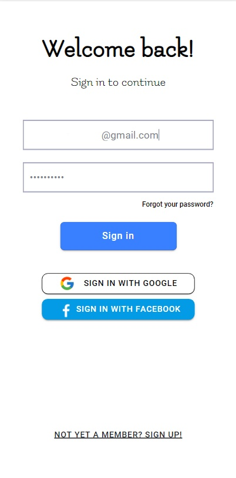
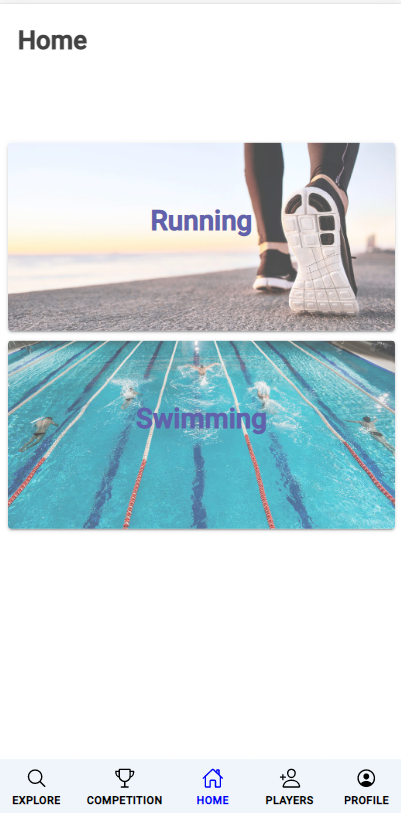
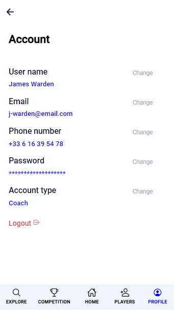
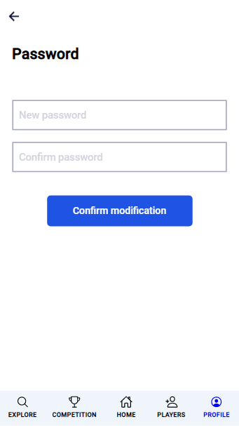
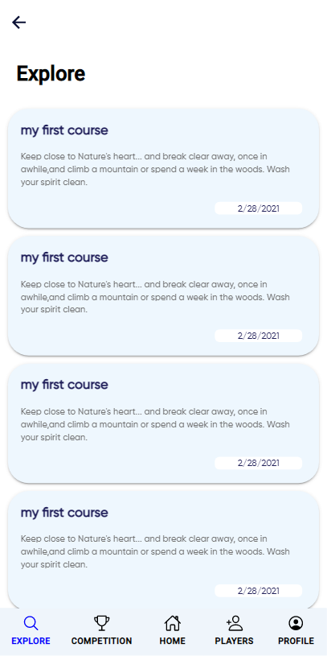

# Ionic Angular managing Running swimming competitions Application

This application is purely developed by Ionic Framework and Angular.

## Table of Contents
- [Getting Started](#getting-started)
- [Deploying](#deploying)
  - [Progressive Web App](#progressive-web-app)
  - [Android](#android)
  - [iOS](#ios)

## Demo

## Getting Started

* [Download the installer](https://nodejs.org/) for Node LTS.
* Install the ionic CLI globally: `npm install -g ionic`
* Clone this repository: `git clone https://github.com/Team-MasterDev/SuiviComp.git`.
* Run `npm install` from the project root.
* Run `ionic serve` in a terminal from the project root.
* Profit. :tada:

## Deploying

### Progressive Web App

1. Run `ionic build --prod`
2. Push the `www` folder to your hosting service

### Android

1. Run `npx cap add android`

### iOS

1. Run `npx cap add ios`
